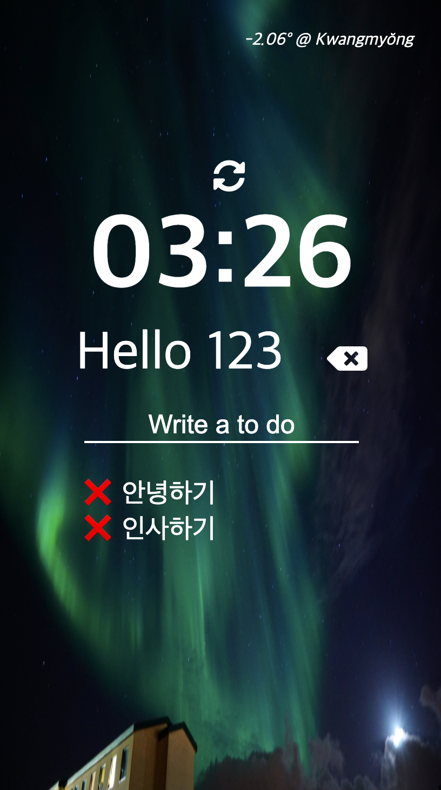

# ☀️개인 목록 만들기 사이트

## 📕 Project

- 한 줄 소개: javascript와 localStorage를 활용한 할일 목록을 만들어주는 간단한 사이트입니다.
- 제작 기간: 21.01.08 ~ 21.01.10
- 개발 환경: 
  &nbsp;&nbsp;
  
  &nbsp;&nbsp;
  

- 개발 인원: 1명

- [포트폴리오](https://www.notion.so/To-do-List-0e8ff444a6e14bd287e4616eff089a47) | [Live Demo](https://www.notion.so/To-do-List-0e8ff444a6e14bd287e4616eff089a47)
  

  ___
desktop
___

___
phone
___

  
  

